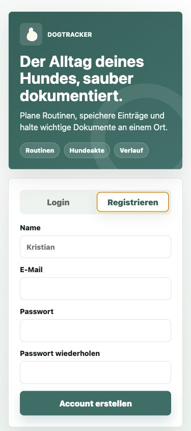
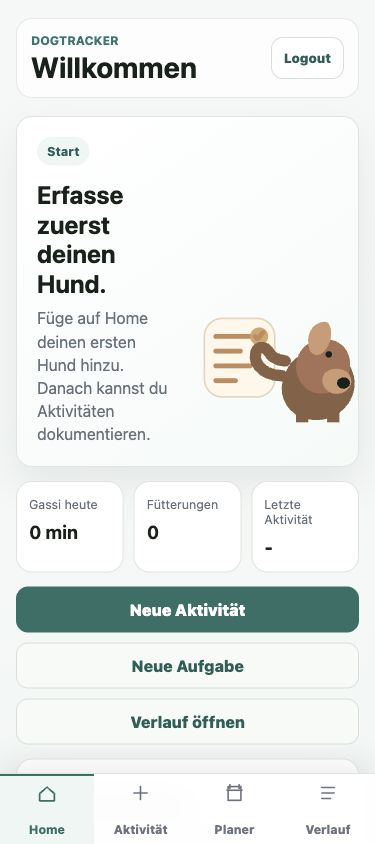
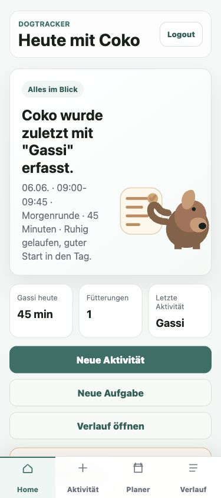
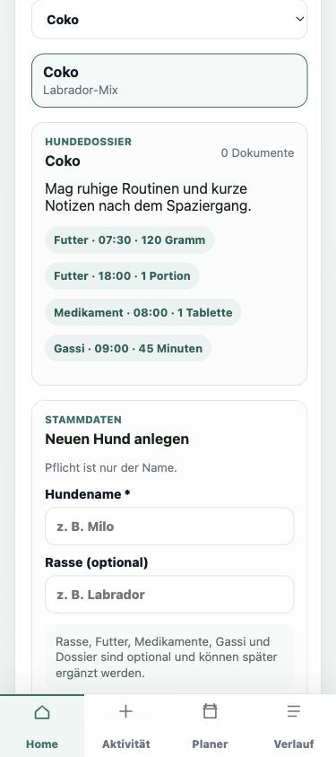
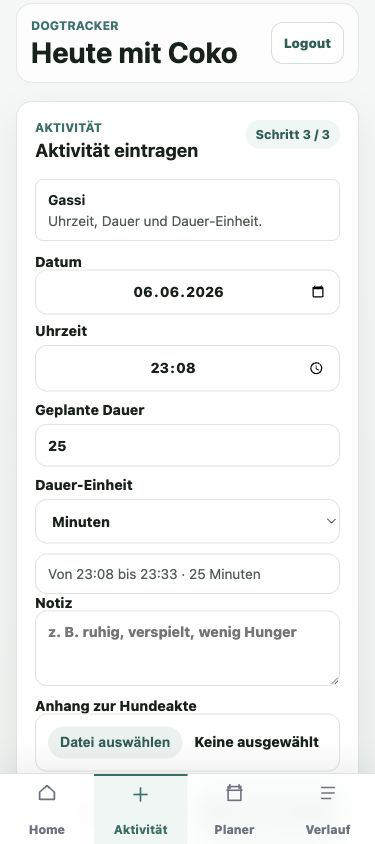
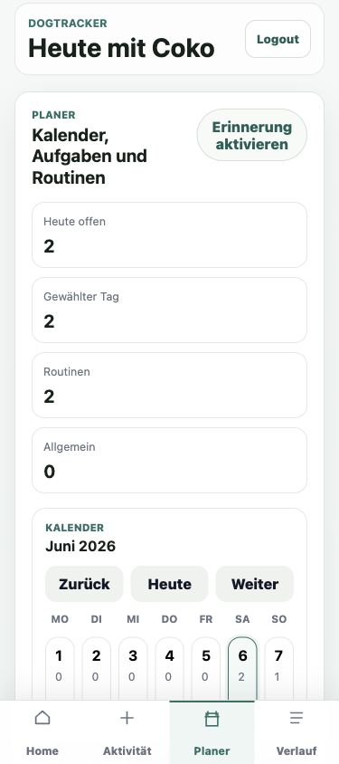
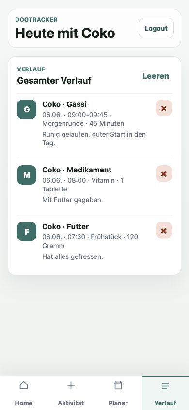

# Projektdokumentation – DogTracker

## Inhaltsverzeichnis

1. [Einordnung & Zielsetzung](#1-einordnung--zielsetzung)
2. [Zielgruppe & Stakeholder](#2-zielgruppe--stakeholder)
3. [Anforderungen & Umfang](#3-anforderungen--umfang)
4. [Vorgehen & Artefakte](#4-vorgehen--artefakte)
    - [Understand & Define](#41-understand--define)
    - [Sketch](#42-sketch)
    - [Decide](#43-decide)
    - [Prototype](#44-prototype)
    - [Validate](#45-validate)
5. [Erweiterungen [Optional]](#5-erweiterungen-optional)
6. [Projektorganisation [Optional]](#6-projektorganisation-optional)
7. [KI-Deklaration](#7-ki-deklaration)
8. [Anhang [Optional]](#8-anhang-optional)

> **Hinweis:** Massgeblich sind die im **Unterricht** und auf **Moodle** kommunizierten Anforderungen.

<!-- WICHTIG: DIE KAPITELSTRUKTUR DARF NICHT VERÄNDERT WERDEN! -->

## 1. Einordnung & Zielsetzung

- **Kontext & Problem:** Hundebesitzer:innen oder Betreuungspersonen müssen Gassi gehen, Fütterungen, Pflege, Medikamente, Arzttermine und wichtige Dokumente oft über Notizen, Chatverläufe oder Gedächtnis organisieren. Dadurch ist nicht immer klar, was bereits erledigt wurde, wann die nächste Aufgabe fällig ist oder wo wichtige Unterlagen abgelegt sind.
- **Ziele:** Ziel des Projekts ist ein mobiler Web-Prototyp, mit dem Nutzer:innen einen Account erstellen, einen oder mehrere Hunde erfassen, Aktivitäten dokumentieren, zukünftige Aufgaben planen und den Verlauf wiederfinden können. Die App soll den Hauptworkflow ohne Erklärung verständlich machen und Daten pro Login getrennt speichern.
- **Abgrenzung [Optional]:** Nicht Bestandteil des Prototyps sind native App-Stores, echte Hintergrund-Push-Notifications bei geschlossener App, Kalender-Synchronisation mit Google/Apple Calendar, Rollen- und Teamverwaltung sowie produktive Sicherheits- und Freigabeprozesse für einen realen Betrieb.

## 2. Zielgruppe & Stakeholder

- **Primäre Zielgruppe:** Hundebesitzer:innen und Personen, die regelmässig auf einen Hund aufpassen und den Alltag einfach dokumentieren möchten.
- **Weitere Stakeholder [Optional]:** Dozierende, Modulverantwortliche und Mitstudierende, welche den Prototyp im Rahmen der Projektabgabe prüfen oder in der Usability Evaluation getestet haben.
- **Annahmen [Optional]:** Die App wird primär mobil genutzt. Nutzer:innen möchten Einträge schnell erfassen, ohne lange Formulare ausfüllen zu müssen. Gleichzeitig sollen Futter, Medikamente und Gassi mit passenden Einheiten geplant werden können.

## 3. Anforderungen & Umfang

- **Kernfunktionalität (Mindestumfang):** Registrierung und Login, leerer Startzustand pro neuem Account, Hunde hinzufügen und verwalten, Aktivitäten erfassen, Aktivitäten löschen, gespeicherte Einträge im Verlauf wiederfinden, Deployment über Netlify, GitHub-Repository und Dokumentation gemäss Vorlage.
- **Akzeptanzkriterien:** Neue Nutzer:innen sehen keine Beispielhunde. Nach dem Login kann ein Hund erfasst werden. Danach kann über `Aktivität` ein Eintrag für Gassi, Futter, Pflege, Medikamente oder Arzt gespeichert werden. Gespeicherte Einträge erscheinen im Dashboard und im Verlauf und können gelöscht werden. Die Anwendung ist öffentlich über Netlify erreichbar und verwendet MongoDB für persistente Daten.
- **Erweiterungen [Optional]:** Planer mit Kalender und Tagesansicht, wiederkehrende Erinnerungen, Erledigt-Funktion, automatische Übernahme erledigter Aufgaben in den Verlauf, mehrere Futter- und Gassi-Zeiten, Medikamentenroutinen, Hundeakte mit Datei-Uploads sowie Cloud-Speicherung über Netlify Blobs.

## 4. Vorgehen & Artefakte

### 4.1 Understand & Define

- **Ausgangslage & Ziele:** Der Prototyp soll den Alltag mit einem Hund nachvollziehbar machen. Die App kombiniert nachträgliche Dokumentation mit vorausschauender Planung.
- **Zielgruppenverständnis:** Die Zielgruppe braucht eine einfache mobile Oberfläche mit klaren Begriffen. Besonders wichtig ist, dass Futter, Medikamente und Gassi nicht überall anders funktionieren, sondern dieselben Felder und Einheiten verwenden.
- **Wesentliche Erkenntnisse:** Der erste Start muss leer sein, damit Nutzer:innen ihren eigenen Hund erfassen. Die wichtigsten Bereiche müssen klar getrennt sein: `Home`, `Aktivität`, `Planer` und `Verlauf`. Dokumente und Fotos sind für eine echte Hundeakte sinnvoller als eine reine externe Datenanzeige.

### 4.2 Sketch

- **Variantenüberblick:** Zu Beginn wurde ein einfacher mobiler Prototyp mit Dashboard und Schnellerfassung skizziert. Danach wurde der Ablauf in Login, Hunde-Erfassung, Aktivitätserfassung, Planer und Verlauf aufgeteilt.
- **Skizzen:** Die frühen Skizzen und das Figma-Mockup dienten als Ausgangspunkt für die mobile Struktur. Im Verlauf wurde der Prototyp stärker auf reale Nutzung angepasst: neue Accounts starten leer, die Hunde-Erfassung ist einklappbar und der Planer ergänzt die reine Nach-Erfassung.

<table align="center">
  <tr>
    <td align="center"><a href="docs/artefacts/Skizze.pdf">Skizze.pdf</a></td>
    <td align="center"><a href="docs/artefacts/DogTracker.pdf">DogTracker.pdf</a></td>
  </tr>
  <tr>
    <td align="center">Frühe Skizzen</td>
    <td align="center">Figma-/Konzept-Export</td>
  </tr>
</table>

### 4.3 Decide

- **Gewählte Variante & Begründung:** Gewählt wurde eine mobile App-Struktur mit Bottom Navigation. Diese Variante passt zur Nutzung unterwegs und trennt die wichtigsten Aufgaben klar: `Home` für Übersicht und Hunde, `Aktivität` für vergangene Einträge, `Planer` für kommende Aufgaben und `Verlauf` für gespeicherte Aktivitäten.
- **End-to-End-Ablauf:** Registrierung/Login -> erster Hund erfassen -> Aktivität speichern -> Eintrag im Dashboard oder Verlauf prüfen -> Eintrag löschen.
- **Referenz-Mockup:** [Figma-Mockup DogTracker](https://www.figma.com/site/oeVTCmei0b0H6m29yesxzv/DogTracker?node-id=0-3&t=sD8JXcT3QnVaDrEd-1)

### 4.4 Prototype

- **Kernfunktionalität:** DogTracker bildet einen vollständigen mobilen Workflow ab. Nutzer:innen registrieren sich, erfassen ihren Hund, hinterlegen optional Routinen, speichern Aktivitäten, planen zukünftige Aufgaben und finden alles im Verlauf wieder.
- **Deployment:** [https://dog-tracker-kristian.netlify.app/](https://dog-tracker-kristian.netlify.app/)

#### 4.4.1. Entwurf (Design)

- **Informationsarchitektur:** Die App besteht aus Login/Registrierung und vier Hauptbereichen nach dem Login:
  - `Home`: Dashboard, fällige Erinnerungen, Hunde-Verwaltung und letzte Einträge
  - `Aktivität`: Schnellerfassung für vergangene Aktivitäten
  - `Planer`: Kalender, Tagesansicht, Routinen und neue Aufgaben
  - `Verlauf`: vollständige Liste gespeicherter Aktivitäten mit Löschfunktion
- **Oberflächenentwürfe:** Die Oberfläche ist für mobile Browser optimiert. Karten, Bottom Navigation, kurze Labels und einheitliche Formularfelder sollen eine schnelle Bedienung ermöglichen.
- **Designentscheidungen:** Futter, Medikamente und Gassi verwenden überall dieselbe Feldlogik. Futter hat Titel, Uhrzeit, Menge und Einheit. Medikamente haben Name, Uhrzeit, Dosis und Einheit. Gassi hat Uhrzeit, Dauer und Dauer-Einheit. Allgemeine Aufgaben bleiben bewusst einfacher.

<table align="center">
  <tr>
    <td></td>
    <td></td>
  </tr>
  <tr>
    <td align="center">Login / Registrierung</td>
    <td align="center">Erster Start ohne Hund</td>
  </tr>
  <tr>
    <td></td>
    <td></td>
  </tr>
  <tr>
    <td align="center">Dashboard mit gespeicherten Einträgen</td>
    <td align="center">Hunde-Verwaltung und Routinen</td>
  </tr>
  <tr>
    <td></td>
    <td></td>
  </tr>
  <tr>
    <td align="center">Aktivität erfassen</td>
    <td align="center">Planer mit Kalender</td>
  </tr>
  <tr>
    <td></td>
    <td></td>
  </tr>
  <tr>
    <td align="center">Gesamter Verlauf</td>
    <td></td>
  </tr>
</table>

#### 4.4.2. Umsetzung (Technik)

- **Technologie-Stack:** SvelteKit, Svelte, JavaScript/TypeScript, MongoDB Atlas, Netlify Functions, Netlify Blobs und Netlify Deployment.
- **Tooling:** Visual Studio Code, GitHub, Netlify, MongoDB Atlas und ChatGPT/Codex.
- **Struktur & Komponenten:** Die App ist komponentenbasiert aufgebaut. Zentrale Komponenten sind `AuthPanel.svelte`, `DogManager.svelte`, `Dashboard.svelte`, `EntryForm.svelte`, `PlannerPanel.svelte`, `Timeline.svelte`, `BottomNav.svelte` sowie wiederverwendbare Feldkomponenten wie `FoodFields`, `MedicationFields`, `WalkFields` und `UnitSelect`.
- **Daten & Schnittstellen [Optional]:** Die strukturierten Daten werden in der MongoDB-Datenbank `dog-tracker` gespeichert. Verwendete Collections sind `users`, `dogs`, `activities` und `reminders`. Die API-Endpunkte laufen über Netlify Functions:
  - `/api/auth`
  - `/api/dogs`
  - `/api/activities`
  - `/api/reminders`
  - `/api/files`
- **Dateien & Cloud-Speicher:** Anhänge wie Fotos, PDFs oder Dokumente werden über die eigene Datei-API `/api/files` hochgeladen und in Netlify Blobs gespeichert. MongoDB speichert nur den Dateiverweis und die Metadaten. Dadurch wirkt die App mehr wie eine Hundeakte und nicht nur wie ein Aktivitätslog.
- **Besondere Entscheidungen:** Passwörter werden serverseitig gehasht. Daten werden über die `userId` dem eingeloggten Account zugeordnet. Browser-Erinnerungen können aktiviert werden, solange die Web-App geöffnet ist. Auf native Push-Benachrichtigungen im Hintergrund wurde bewusst verzichtet, weil dies für den Prototyp fehleranfälliger und weniger stabil gewesen wäre.

### 4.5 Validate

- **URL der getesteten Version:** [https://dog-tracker-kristian.netlify.app/](https://dog-tracker-kristian.netlify.app/)
- **Ziele der Prüfung:** Die Usability Evaluation sollte zeigen, ob Testpersonen den Hauptworkflow verstehen: Login/Registrierung, Hund hinzufügen, Aktivität über `Aktivität` speichern, Eintrag wiederfinden und wieder löschen.
- **Vorgehen:** Die Evaluation wurde als moderierter, szenario-basierter Usability-Test vor Ort durchgeführt. Die Testpersonen erhielten eine schriftliche Aufgabe und wurden während der Durchführung beobachtet.
- **Stichprobe:** Getestet wurde mit zwei Mitstudierenden, die den Prototyp nicht im Detail kannten.
- **Aufgaben/Szenarien:** Die Testpersonen sollten ein Konto erstellen oder sich einloggen, den ersten Hund hinzufügen, danach eine Aktivität wie einen Spaziergang mit Uhrzeit, Dauer und Notiz speichern, den Eintrag im Dashboard oder Verlauf wiederfinden und ihn anschliessend löschen.
- **Kennzahlen & Beobachtungen:** 2 von 2 Testpersonen konnten die Aufgabe erfolgreich abschliessen. Login und Registrierung wurden gefunden. Der Button `Aktivität` wurde als Einstieg für neue Aktivitäten verstanden. Der Verlauf und die Löschfunktion wurden gefunden. In einer früheren Version war jedoch unklar, warum ein neuer Account bereits Hunde angezeigt bekam.
- **Zusammenfassung der Resultate:** Der zentrale Workflow ist verständlich, wenn neue Nutzer:innen wirklich leer starten. Die Navigation mit `Home`, `Aktivität`, `Planer` und `Verlauf` wurde als sinnvoll bestätigt, weil sie die Aufgabenbereiche klar trennt.
- **Abgeleitete Verbesserungen:** Neue Accounts starten ohne Hunde. Die Hunde-Erfassung wird am Anfang sichtbar angeboten und danach einklappbar. Die Aktivitätserfassung wurde als eigener Bereich benannt. Futter-, Medikamenten- und Gassi-Felder wurden vereinheitlicht. Der vollständige Verlauf erhielt einen eigenen Tab.
- **Umgesetzte Anpassungen [Optional]:** Passwort-Wiederholung bei Registrierung, mobile Formularoptimierung, Datei-Uploads für Hundeakte, Planer mit Kalender, Browser-Erinnerungen und klarere README-Dokumentation.

## 5. Erweiterungen [Optional]

- **Beschreibung & Nutzen:** Über den Mindestumfang hinaus wurden Planer, Erinnerungen, Datei-Uploads und Hundeakte umgesetzt. Dadurch wird DogTracker nicht nur zu einem Logbuch, sondern zu einer kleinen Alltagszentrale für Hundebetreuung.
- **Umsetzung in Kürze:** Der Planer speichert offene und wiederkehrende Aufgaben in MongoDB. Aufgaben können als erledigt markiert werden und werden danach als Aktivität im Verlauf gespeichert. Anhänge werden über Netlify Blobs abgelegt.
- **Abgrenzung zum Mindestumfang:** Für den Grundworkflow wären Login, Hund, Aktivität und Verlauf ausreichend. Kalender, Erinnerungen, Dossier-Dateien und Cloud-Speicher erhöhen den Praxisnutzen, sind aber Erweiterungen.

## 6. Projektorganisation [Optional]

- **Repository & Struktur:** [https://github.com/PerkoKri/dog-tracker](https://github.com/PerkoKri/dog-tracker)
- **Deployment:** [https://dog-tracker-kristian.netlify.app/](https://dog-tracker-kristian.netlify.app/)
- **Issue-Management:** Die Weiterentwicklung erfolgte iterativ anhand der Übungsanforderungen, der Usability-Beobachtungen und des laufenden Feedbacks. Offene Punkte wurden priorisiert und direkt im Prototyp umgesetzt.
- **Commit-Praxis:** Änderungen wurden mit sprechenden Commit-Messages versioniert, z. B. für Login, MongoDB-Anbindung, Datei-Uploads, Planer, UI-Anpassungen und README-Finalisierung.

## 7. KI-Deklaration

### Eingesetzte KI-Werkzeuge

ChatGPT/Codex von OpenAI.

### Zweck & Umfang

KI wurde im gesamten Projekt unterstützend eingesetzt. Sie half bei der Schärfung der Projektidee, der Strukturierung der Workflows, der Umsetzung von Svelte-Komponenten, der MongoDB-/Netlify-Anbindung, beim Debugging, beim Refactoring, bei UI-Verbesserungen und bei der README-Dokumentation.

Der Einsatz erfolgte iterativ. Vorschläge wurden geprüft, angepasst und auf DogTracker übertragen. Die Verantwortung für Projektidee, Priorisierung, Funktionsumfang und finale Entscheidungen lag beim Projektverfasser.

### Art der Beiträge

KI wurde unterstützend eingesetzt für:

- Ausarbeitung und Verfeinerung der Nutzungsszenarien
- Vorschläge zu Komponentenstruktur und Formularlogik
- Debugging und technische Umsetzung von Netlify Functions
- MongoDB-Anbindung und Datenmodellierung
- Erstellung und Überarbeitung der README
- Formulierung der Usability-Testaufgabe und Auswertung

### Eigene Leistung (Abgrenzung)

Die inhaltliche Konzeption, die Auswahl des Funktionsumfangs, die fachliche Ausrichtung auf Hundebetreuung, das Testfeedback und die finalen Entscheidungen wurden eigenständig bestimmt. KI-generierte Inhalte dienten als Vorschläge und wurden kritisch geprüft.

### Reflexion

Der KI-Einsatz hat die Umsetzung beschleunigt und geholfen, technische Probleme schneller zu lösen. Gleichzeitig zeigte sich, dass KI-Vorschläge nicht ungeprüft übernommen werden können. Besonders bei Usability, Datenpersistenz, Sicherheit und Deployment mussten Lösungen mehrfach angepasst und getestet werden.

### Prompt-Vorgehen [Optional]

Die Prompts wurden schrittweise aufgebaut. Zuerst wurden Ziel, Mindestanforderungen und vorhandene Dateien beschrieben. Danach wurden konkrete Teilaufgaben formuliert, z. B. Login ergänzen, MongoDB anbinden, Hunde-Verwaltung ausbauen, Formularfelder vereinheitlichen, Datei-Upload ergänzen oder README nach Vorlage finalisieren.

### Quellen & Rechte [Optional]

Es wurden keine kostenpflichtigen Assets oder geschützten Inhalte direkt übernommen. Die Screenshots stammen aus dem eigenen Prototyp. Die Dokumentation orientiert sich an der bereitgestellten Kapitelstruktur und wurde inhaltlich für DogTracker neu formuliert.

## 8. Anhang [Optional]

- **Live-App:** [https://dog-tracker-kristian.netlify.app/](https://dog-tracker-kristian.netlify.app/)
- **GitHub:** [https://github.com/PerkoKri/dog-tracker](https://github.com/PerkoKri/dog-tracker)
- **Figma-Mockup:** [DogTracker Figma](https://www.figma.com/site/oeVTCmei0b0H6m29yesxzv/DogTracker?node-id=0-3&t=sD8JXcT3QnVaDrEd-1)
- **Skizzen & Konzept:** [Skizze.pdf](docs/artefacts/Skizze.pdf), [DogTracker.pdf](docs/artefacts/DogTracker.pdf)
- **Zugangsdaten:** Kein fixer Testaccount notwendig. Dozierende können direkt einen neuen Account registrieren und danach den ersten Hund erfassen.

<!-- Prüfliste (nicht abgeben, nur intern nutzen)
[x] Kernfunktionalität gemäss Übungen umgesetzt
[x] Akzeptanzkriterien formuliert und erfüllt
[x] Skizzen und Figma referenziert
[x] Deployment erreichbar
[x] Umsetzung technisch beschrieben
[x] Evaluation durchgeführt und dokumentiert
[x] KI-Deklaration ausgefüllt
[x] Screenshots aktualisiert
-->
